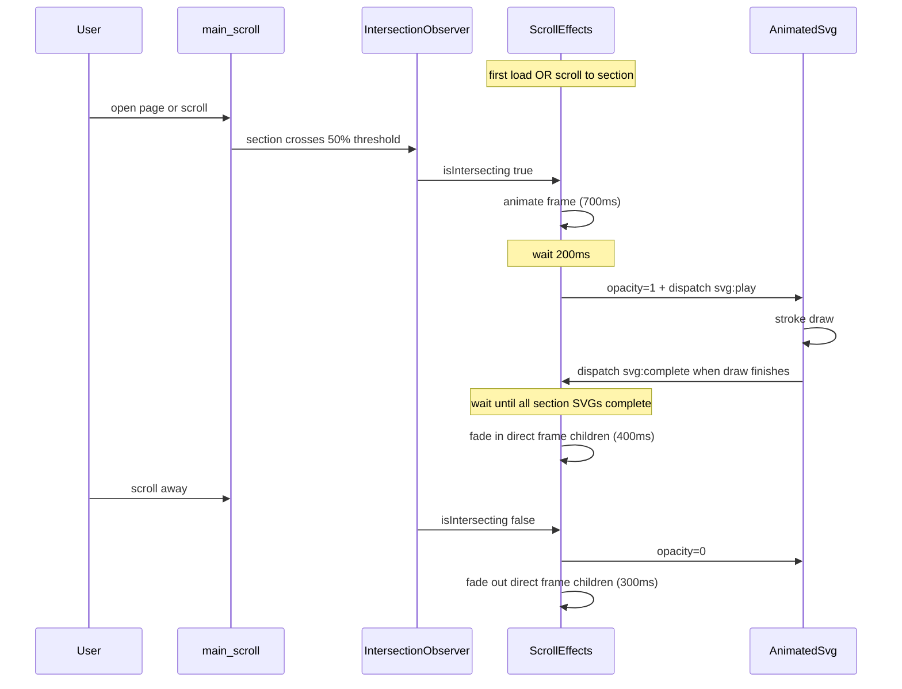

# Fade In/Out + AnimatedSvg System Analysis

## Architecture Overview

The site is a single-page vertical scroller: [`app/page.tsx`](app/page.tsx) renders four sections inside `<main>`. Global animation is driven by two client components mounted in [`app/layout.tsx`](app/layout.tsx):

- **[`ScrollEffects`](app/components/scroll-effects.tsx)** — section-level scroll choreography (frame entrance, SVG reveal, content fade)
- **[`AnimatedSvg`](app/components/home-hero-draw.tsx)** — per-instance SVG fetch + anime.js stroke-draw animation, triggered by custom events



### DOM contract ScrollEffects expects

For each `<section>` inside `<main>`:

| Element | Role |
|---|---|
| `section.firstElementChild` | **Frame** — gets the main entrance animation (translateY, scale, opacity, slight rotate) |
| `[data-svg-container]` anywhere inside section | **AnimatedSvg wrapper** — hidden initially, revealed at +200ms, receives `svg:play` |
| Direct children of frame (except `data-svg-container` and `.blackboard`) | **Content layer** — hidden initially on **all** sections, faded in after all section SVGs emit `svg:complete`, faded out on exit |

[`SectionContainer`](app/components/section-container.tsx) provides the `<section>` shell; each page supplies one inner `<div>` as the frame.

---

## How AnimatedSvg works

[`AnimatedSvg`](app/components/home-hero-draw.tsx) renders an empty `<div data-svg-container>` and on mount:

1. Fetches the SVG file from `src`
2. Injects it as innerHTML
3. Listens for `svg:play` on the container
4. On play: finds `path, line, polyline, rect` elements, uses anime.js `svg.createDrawable()` to animate stroke draw from `0 0` → `0 1`

Key props:

- **`autoplay` (default `true`)** — draws immediately after fetch AND on every `svg:play`
- In-section SVGs (inside `<main>`) should use **`autoplay={false}`** so the only draw path is `svg:play` from ScrollEffects — avoids double draw on first load and keeps first render identical to scroll-enter
- **`delayOnDesktopOnly`** — skips stagger delay on mobile (`<768px`)
- **`duration` / `delayStep`** — control draw speed and stagger between paths

The container always has `data-svg-container`, which is how ScrollEffects finds and orchestrates it.

**Proposed addition:** dispatch a `svg:complete` custom event on the container when the active draw animation finishes. ScrollEffects will listen for this instead of using a hardcoded delay.

---

## How ScrollEffects works

On mount, [`ScrollEffects`](app/components/scroll-effects.tsx):

**Initial state setup (all sections treated equally — no section-0 exception)**
- Every frame: hidden (`opacity: 0`, `translateY(48px) scale(0.96)`)
- All `[data-svg-container]` in every section: `opacity: 0`
- All direct frame children (non-SVG, non-blackboard): `opacity: 0`

**First render (page load on home)**
- Must run the **same** `enterSection(section, index)` path as scroll-enter — not a separate code path.
- After initial hidden setup and observer registration, explicitly call `enterSection` for the section currently in view (home at `scrollTop === 0`), in addition to relying on IntersectionObserver for subsequent scrolls.
- Result on first visit: blank/hidden home → frame slides in → SVG draws → text/socials fade in — identical to scrolling back to home later.

**On section enter** (50% visible via IO, or explicit first-render trigger):
1. **t=0ms** — Frame animates in (700ms, `outExpo`)
2. **t=200ms** — All SVG containers in section → `opacity: 1` + `svg:play` event
3. **After all SVG draws complete** — Direct frame children fade in (400ms), triggered by `svg:complete` events (replaces hardcoded `1400ms`)

**On section leave**:
- SVG containers → `opacity: 0`
- Direct frame children fade out (300ms)
- Frame itself is **not** reset (stays visible)

Also updates `--scroll-progress` CSS var for the nav progress bar.

---

## Page-by-page analysis

### 1. Home — [`app/pages/homepage.tsx`](app/pages/homepage.tsx)

**DOM structure**
```
section#home
  └── div (frame)
        ├── div (text + social links)     ← direct child, content fade
        └── AnimatedSvg (whimsicott)      ← direct child, data-svg-container
```

**Assessment: Correct structure; first render currently broken by section-0 exception**

- Frame/SVG/content layering matches the contract.
- `AnimatedSvg` is a direct child — ideal structure.
- **Current bug:** Section 0 frame and text are visible before any animation runs; content re-fades after draw. Fixed by unified initial hidden state + explicit `enterSection` on mount.
- **Current bug:** `autoplay=true` causes invisible draw before `svg:play`. Fixed by `autoplay={false}` on in-section SVGs.

---

### 2. Experience — [`app/pages/experience.tsx`](app/pages/experience.tsx)

**DOM structure**
```
section#experience
  └── div.blackboard (frame — blackboard styling on frame itself)
        ├── div (title + ExperienceGallery)   ← direct child, content fade
        └── div (SVG wrapper)                 ← direct child, content fade
              ├── AnimatedSvg machine
              ├── AnimatedSvg red_cogfly
              └── AnimatedSvg purple_cogfly
```

**Assessment: Correct structure, coarse content staging**

- All 3 `AnimatedSvg` instances are found via `section.querySelectorAll('[data-svg-container]')` even though nested — **works correctly**.
- All 3 receive `svg:play` simultaneously on enter — **correct** for parallel draw (`delayStep={0}`).
- Content fade applies to the two column divs as whole units — gallery cards and title fade together, not individually. This is intentional given the current API.
- `.blackboard` on the **frame** (not a child) means the blackboard animates as the entrance frame, not as a content child — **correct**.
- [`ExperienceGallery`](app/components/experience-gallery.tsx) is a client component (LightGallery) nested inside the left column; it inherits the parent column's opacity fade — **loads correctly**, no separate scroll animation needed.

---

### 3. Projects — [`app/pages/projects.tsx`](app/pages/projects.tsx)

**DOM structure**
```
section#projects
  └── div (frame)
        ├── h1 "PROJECTS"                   ← direct child, content fade
        ├── AnimatedSvg (pot.svg)           ← direct child, SVG layer
        └── div × 6 (leaf wrappers)         ← direct children, content fade
              └── inline Leaf SVG components (NOT AnimatedSvg)
```

**Assessment: Best-aligned page structure**

- Pot uses `AnimatedSvg` — gets draw + scroll orchestration.
- Title and leaves are direct frame children excluded from SVG handling — fade in after pot draw completes. **Correct sequencing.**
- Leaf SVGs are static inline components — they do not participate in the draw system; they only get the content fade. **Correct.**
- **Potential conflict:** Leaf wrappers use inline `opacity` for hover dimming (`0.5` when another leaf is hovered). ScrollEffects also sets opacity on enter/leave — these can fight each other after scroll animations complete.

---

### 4. Other — [`app/pages/other.tsx`](app/pages/other.tsx)

**DOM structure**
```
section#other
  └── div (frame)
        ├── div (left column)               ← direct child, content fade
        │     ├── h1 "PROJECTS"
        │     └── AnimatedSvg (coffee.svg)
        └── div (right column)              ← direct child, content fade
              ├── AnimatedSvg (projectbackground.svg)
              └── div (scrollable project list)
```

**Assessment: Correct but coarse staging**

- Both `AnimatedSvg` instances are found at section level — **works correctly**.
- Coffee and background SVG both get `svg:play` at +200ms — **correct**.
- Content fade applies to entire left/right columns after both SVG draws complete — title, coffee, background, and project cards all fade in as two blocks, not staged separately.
- Inner scrollable project list (`overflow-y-auto`) is inside the right column — it fades with the column, not independently. **Loads correctly**, but no per-card scroll animation.

---

### 5. Navbar (outside scroll system) — [`app/components/nav.tsx`](app/components/nav.tsx)

**Not a page section**, but uses `AnimatedSvg` for the fixed nav background (`/assets/background.svg`).

- Lives in `<aside>` outside `<main>` — **not observed by ScrollEffects**.
- Autoplays on mount only; never receives `svg:play` from scroll.
- **Correct** for a persistent decorative element.

---

## Summary: what loads correctly vs. what to watch

| Page | Frame | SVG draw | Content fade | Verdict |
|---|---|---|---|---|
| Home | Fixed by unified enter | Fixed by autoplay=false | Fixed by unified enter | Was broken on first load |
| Experience | OK | OK (3 parallel SVGs) | Coarse (2 columns) | Correct |
| Projects | OK | OK (pot) | OK (title + leaves staged) | Best match to design intent |
| Other | OK | OK (2 SVGs) | Coarse (2 columns) | Correct |
| Navbar | N/A | Autoplay only | N/A | Correct (outside system) |

### Cross-cutting issues (not page-specific)

1. **Uncancelled timeouts / stale callbacks** — the +200ms SVG reveal timeout and any in-flight `svg:complete` listeners are not cleared on rapid scroll, so fade triggers can fire out of order when scrolling quickly between sections. The new completion listener must be removed on section leave.
2. **Asymmetric exit** — leaving a section hides SVGs and content but not the frame; re-entering re-runs frame entrance on an already-visible frame.
3. **Hardcoded 1400ms delay** — content fade can start before or after the actual draw finishes depending on path count, `duration`, and `delayStep`. **This is the primary fix to implement.**
4. **First-section special case** — section 0 currently skips hidden initial state, so first render does not match scroll-enter. **Remove this exception as part of implementation.**

---

## Implementation plan

### A. Unified first render (same as scroll-enter)

**Goal:** Opening the page for the first time runs the identical sequence as scrolling to a section.

#### 1. Refactor [`ScrollEffects`](app/components/scroll-effects.tsx) — extract `enterSection`

Extract the enter logic (frame animate → +200ms SVG reveal/`svg:play` → wait for `svg:complete` → content fade) into a single function:

```ts
function enterSection(section: HTMLElement, index: number) { ... }
function leaveSection(section: HTMLElement, frame: HTMLElement) { ... }
```

**Initial setup — remove `index === 0` branches:**

```ts
sections.forEach((section, index) => {
  const frame = section.firstElementChild as HTMLElement | null
  if (!frame) return

  // ALL sections start hidden (including home)
  frame.style.opacity = '0'
  frame.style.transform = 'translateY(48px) scale(0.96)'

  section.querySelectorAll<HTMLElement>('[data-svg-container]').forEach((svg) => {
    svg.style.opacity = '0'
  })

  Array.from(frame.children).forEach((child) => {
    const el = child as HTMLElement
    if (!el.hasAttribute('data-svg-container') && !el.classList.contains('blackboard')) {
      el.style.opacity = '0'
    }
  })
})
```

**Trigger enter on first render:**

After `observer.observe(section)` for each section, explicitly enter the initially visible section:

```ts
const initialSection = sections.find((section) => {
  const rect = section.getBoundingClientRect()
  const rootRect = scrollContainer.getBoundingClientRect()
  const visibleHeight = Math.min(rect.bottom, rootRect.bottom) - Math.max(rect.top, rootRect.top)
  return visibleHeight >= rect.height * 0.5
}) ?? sections[0]

if (initialSection) {
  enterSection(initialSection, sections.indexOf(initialSection))
}
```

Use the same 50% visibility rule as the observer threshold so first load and scroll behave consistently. Guard against double-enter if IO also fires for the same section on mount (track `enteredSections` Set or an enter generation token per section).

**IntersectionObserver callback:** call `enterSection` / `leaveSection` instead of inlined logic.

#### 2. Set `autoplay={false}` on all in-main SVGs

Update page components to pass `autoplay={false}` on every `AnimatedSvg` inside `<main>`:

- [`homepage.tsx`](app/pages/homepage.tsx) — whimsicott
- [`experience.tsx`](app/pages/experience.tsx) — 3 SVGs
- [`projects.tsx`](app/pages/projects.tsx) — pot
- [`other.tsx`](app/pages/other.tsx) — coffee + background

Leave navbar background SVG in [`nav.tsx`](app/components/nav.tsx) at default `autoplay={true}` (outside scroll system).

With `autoplay={false}`, `AnimatedSvg` already hides paths until first `svg:play` — no invisible pre-draw.

---

### B. Wait for stroke-draw completion (replaces 1400ms)

Replace the `setTimeout(..., 1400)` content fade with an event-driven gate tied to real animation completion.

### 1. [`AnimatedSvg`](app/components/home-hero-draw.tsx) — emit `svg:complete`

In `playAnimation()`, attach an `onComplete` callback to the anime.js `animate()` call:

```ts
const notifyComplete = () => {
  container.dispatchEvent(new CustomEvent('svg:complete', { bubbles: true }))
}

// drawable path
animate(drawables, {
  draw: ['0 0', '0 1'],
  ease: 'inOutSine',
  duration,
  delay: stagger(actualDelayStep),
  onComplete: notifyComplete,
})

// opacity fallback (no drawable paths)
animate(svgRoot, {
  opacity: [0, 1],
  scale: [0.985, 1],
  ease: 'outQuad',
  duration: Math.min(duration, 700),
  onComplete: notifyComplete,
})
```

Notes:
- Use `bubbles: true` so ScrollEffects can listen once on the `<section>` rather than per container.
- Only emit `svg:complete` for draws triggered by `svg:play` (with `autoplay={false}` on in-section SVGs, this is the only draw path in `<main>`).
- If `playAnimation()` is called again before the prior draw finishes, ignore stale `svg:complete` events (increment a play generation counter).

### 2. [`ScrollEffects`](app/components/scroll-effects.tsx) — gate content fade on all SVGs

On section enter (inside the existing +200ms SVG reveal block):

```ts
const svgContainers = section.querySelectorAll<HTMLElement>('[data-svg-container]')
const pending = svgContainers.length

if (pending === 0) {
  fadeInFrameChildren(frame)
  return
}

let completed = 0
const onSvgComplete = () => {
  completed++
  if (completed >= pending) {
    section.removeEventListener('svg:complete', onSvgComplete)
    fadeInFrameChildren(frame)
  }
}
section.addEventListener('svg:complete', onSvgComplete)

svgContainers.forEach((container) => {
  container.style.opacity = '1'
  container.dispatchEvent(new CustomEvent('svg:play', { bubbles: false }))
})
```

Extract the existing child fade loop into a `fadeInFrameChildren(frame)` helper (same logic as today).

On section leave:
- Remove any pending `svg:complete` listener for that section.
- Cancel/ignore in-flight completion counters so a stale complete does not fade content back in after leaving.

### 3. Edge cases

| Case | Behavior |
|---|---|
| Section with 0 SVGs | Fade content immediately (no wait) |
| Section with multiple SVGs (Experience: 3, Other: 2) | Wait until **all** emit `svg:complete` |
| Fast scroll away before draw finishes | Remove listener + abort pending fade |
| Navbar SVG (outside `<main>`) | Unaffected — keeps `autoplay={true}`, no `svg:complete` listener |
| First page load on home | Same `enterSection` as scroll; guard against double-enter from IO + explicit trigger |
| `autoplay={false}` on in-main SVGs | Single draw path via `svg:play`; no pre-draw before ScrollEffects orchestrates |

### 4. Page impact after change

| Page | SVG count | Content fade trigger |
|---|---|---|
| Home | 1 | After whimsicott draw completes |
| Experience | 3 | After slowest of machine + cogflies completes |
| Projects | 1 | After pot draw completes |
| Other | 2 | After slower of coffee + background completes |

### C. Files to change

| File | Change |
|---|---|
| [`scroll-effects.tsx`](app/components/scroll-effects.tsx) | Remove section-0 exception; extract `enterSection`/`leaveSection`; `svg:complete` gating; explicit first-render enter; abort listeners on leave |
| [`home-hero-draw.tsx`](app/components/home-hero-draw.tsx) | Emit `svg:complete` on draw finish |
| [`homepage.tsx`](app/pages/homepage.tsx) | `autoplay={false}` on hero SVG |
| [`experience.tsx`](app/pages/experience.tsx) | `autoplay={false}` on 3 SVGs |
| [`projects.tsx`](app/pages/projects.tsx) | `autoplay={false}` on pot SVG |
| [`other.tsx`](app/pages/other.tsx) | `autoplay={false}` on 2 SVGs |

---

## Other optional fixes (lower priority)

- **ScrollEffects:** Optionally reset frame on exit.
- **Projects:** Nest fade target one level deeper so leaf hover opacity is not overwritten.
